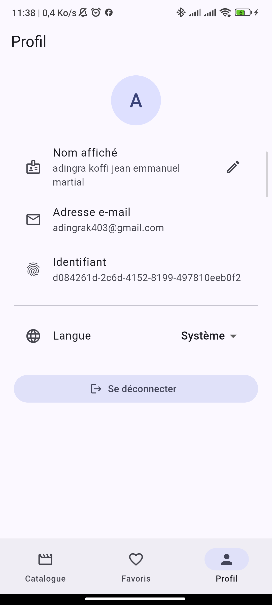

# CinéClub — application Flutter full-stack

[](https://github.com/OWNER/REPO/actions/workflows/ci.yml)
[](https://docs.flutter.dev)
[](lib/l10n/arb)
[](LICENSE)

> Remplacez `OWNER/REPO` dans l'URL du badge CI par le chemin réel du dépôt,
> sinon le badge restera gris.

Application Flutter connectée à un backend **Supabase** (authentification JWT +
API REST PostgREST), avec **cache local Hive CE**, **mode hors-ligne**,
**interface bilingue français / anglais** et **étiquettes d'accessibilité**
sur tous les éléments interactifs.

## Captures d'écran

| Connexion | Catalogue | Détail | Favoris | Profil |
|---|---|---|---|---|
|  |  |  |  |  |

Procédure de capture : [`docs/screenshots/README.md`](docs/screenshots/README.md).

| Exigence du sujet | Où c'est implémenté |
|---|---|
| Authentification (login / register / logout) — JWT | `lib/features/auth/`, endpoints GoTrue |
| ≥ 3 écrans de données issues d'une API REST | Catalogue, Détail film, Favoris, Profil (4 écrans) |
| Cache local (Hive) | `lib/core/storage/`, `*_local_data_source.dart` |
| Mode hors-ligne | `*_repository_impl.dart` + `OfflineBanner` |
| Gestion d'erreurs réseau avec messages utilisateur | `lib/core/network/error_mapper.dart`, `ErrorView` |
| Architecture Clean + Feature-First | `lib/core/` + `lib/features/<feature>/{data,domain,presentation}` |
| Repository pattern | interface dans `domain/repositories/`, implémentation dans `data/repositories/` |
| Dio | `lib/core/network/dio_factory.dart` |
| Intercepteur d'injection du token | `lib/core/network/auth_interceptor.dart` |
| Gestion du refresh token | même fichier (proactif + réactif sur 401) |
| ≥ 3 tests unitaires sur la couche repository | `test/features/*/data/*_repository_impl_test.dart` |

---

## 1. Démarrage rapide

Le projet Supabase `qkzpjimpmehmfqzgzuqy` est déjà renseigné dans `env.json`
et `supabase/db.env` (deux fichiers **non versionnés**). Il reste à créer le
schéma côté serveur.

```bash
# 1. Dépendances
flutter pub get

# 2. Schéma + données de démonstration
source supabase/db.env && ./supabase/apply_schema.sh
#    (ou : coller supabase/schema.sql puis seed.sql dans le SQL Editor)

# 3. Authentification : désactiver « Confirm email »
#    Dashboard > Authentication > Providers > Email  (sinon pas de token
#    à l'inscription et l'écran de connexion restera bloqué)

# 4. Vérification du backend, sans lancer Flutter
./supabase/smoke_test.sh

# 5. Génération des traductions (rejouée automatiquement par `flutter run`)
flutter gen-l10n

# 6. Lancement
flutter run --dart-define-from-file=env.json

# 7. Qualité — exactement ce que la CI exécute
#    Au premier passage, lancez d'abord `dart format .` et committez :
#    l'étape de format était auparavant en `continue-on-error`, le dépôt
#    peut donc contenir des fichiers jamais formatés.
dart format --output=none --set-exit-if-changed $(git ls-files '*.dart' | grep -v '^lib/l10n/')
flutter analyze
flutter test --coverage          # tests unitaires + tests de widgets
flutter test integration_test    # tests d'intégration, sans émulateur
```

### Où vivent les secrets

| Fichier | Contenu | Versionné | Lu par |
|---|---|---|---|
| `env.json` | URL + clé publiable | non | l'app, via `--dart-define-from-file` |
| `env.example.json` | gabarit | oui | — |
| `supabase/db.env` | chaîne PostgreSQL + mot de passe | non | `apply_schema.sh` uniquement |
| `supabase/db.env.example` | gabarit | oui | — |

La **clé publiable est publique par conception** : elle identifie le projet,
elle n'autorise rien. Toute la protection repose sur les politiques RLS de
`supabase/schema.sql`. Le **mot de passe PostgreSQL, lui, est un secret
critique** : il donne un accès `postgres` complet qui contourne la RLS. Il
n'est jamais lu par l'application Flutter et ne doit jamais l'être — le
client mobile passe exclusivement par PostgREST.

Aucune clé n'est écrite en dur dans le code : `AppConfig.fromDartDefine()`
échoue explicitement au démarrage si la configuration manque.

---

## 2. Architecture

Organisation **feature-first**, chaque feature étant découpée en trois couches
Clean Architecture. Le sens des dépendances est toujours le même :

```
presentation ──► domain ◄── data
                  ▲
                  │  (aucune dépendance sortante)
             core (transverse)
```

```
lib/
├── core/                        # transverse, ne dépend d'aucune feature
│   ├── config/                  # AppConfig (dart-define)
│   ├── error/                   # Failure, Exception, Result, Cached
│   ├── network/                 # DioFactory, AuthInterceptor, ErrorMapper, NetworkInfo
│   ├── session/                 # AuthSession, SessionManager, TokenRefresher
│   ├── storage/                 # boîtes Hive, JsonBoxStore
│   ├── state/                   # AsyncState
│   ├── settings/                # LocaleController (langue choisie)
│   ├── l10n/                    # traduction des Failure (FailureCode -> texte)
│   └── widgets/                 # AsyncView, OfflineBanner, ErrorView, PosterImage
├── l10n/
│   ├── arb/                     # SOURCE des traductions (app_en.arb, app_fr.arb)
│   └── app_localizations*.dart  # GÉNÉRÉ par `flutter gen-l10n`, versionné
├── features/
│   ├── auth/       {data,domain,presentation}
│   ├── movies/     {data,domain,presentation}
│   ├── favorites/  {data,domain,presentation}
│   └── profile/    {data,domain,presentation}
├── app.dart                     # thème, locale, aiguillage AuthGate
├── app_providers.dart           # arbre de providers, substituable en test
├── bootstrap.dart               # composition root (seule injection concrète)
└── main.dart
```

**Règles appliquées**

- `domain/` ne contient que des entités et des interfaces : aucun import de
  Dio, Hive ou Flutter. C'est ce qui rend les tests indépendants des plugins.
- `data/` contient les *data sources* (un remote, un local) et
  l'implémentation du repository. Elle traduit les `Exception` en `Failure`.
- `presentation/` ne connaît que les interfaces `domain`. Elle ne reçoit
  jamais de phrase toute faite : un `Failure` porte un `FailureCode`, un
  `AuthController` expose un `AuthNotice` — c'est l'écran qui choisit la
  traduction. Sans cette règle, changer de langue laisserait des phrases
  françaises sur une interface anglaise.
- Une seule composition root : `bootstrap.dart`. Aucun singleton global,
  aucun `GetIt` — les dépendances sont fournies par `provider` et donc
  substituables en test. L'arbre lui-même vit dans `app_providers.dart`, ce
  qui permet aux tests d'intégration de monter **l'application réelle** en ne
  remplaçant que les quatre interfaces de `domain/`.

Détails et diagrammes : [`docs/ARCHITECTURE.md`](docs/ARCHITECTURE.md).

---

## 3. APIs utilisées

Backend : **Supabase** (PostgreSQL + GoTrue + PostgREST). Les appels sont
faits directement en REST avec Dio, **sans le SDK `supabase_flutter`** : le
sujet demande un intercepteur et une gestion explicite du refresh token, que
le SDK masquerait entièrement.

### Authentification — `<SUPABASE_URL>/auth/v1`

| Méthode | Endpoint | Usage |
|---|---|---|
| POST | `/signup` | inscription (`data.display_name` → métadonnées) |
| POST | `/token?grant_type=password` | connexion |
| POST | `/token?grant_type=refresh_token` | renouvellement du token |
| POST | `/logout` | révocation de la session |

### Données — `<SUPABASE_URL>/rest/v1`

| Méthode | Endpoint | Écran |
|---|---|---|
| GET | `/movies?select=*&order=release_year.desc` | Catalogue |
| GET | `/movies?select=*&id=eq.<uuid>` | Détail |
| GET | `/favorites?select=id,created_at,movie:movies(*)&order=created_at.desc` | Favoris |
| POST | `/favorites` (corps `{"movie_id": "<uuid>"}`) | Ajout favori |
| DELETE | `/favorites?movie_id=eq.<uuid>` | Retrait favori |
| GET | `/profiles?select=*&id=eq.<uuid>` | Profil |
| PATCH | `/profiles?id=eq.<uuid>` | Mise à jour du profil |

Contrat détaillé (corps, codes d'erreur) : [`docs/API.md`](docs/API.md).

---

## 4. Authentification et refresh token

Deux clients Dio distincts, construits par `DioFactory` :

- `createAuthClient()` → `/auth/v1`, **sans** intercepteur. Un 401 y signifie
  « mauvais mot de passe », pas « token à rafraîchir ».
- `createApiClient()` → `/rest/v1`, **avec** `AuthInterceptor`.

`AuthInterceptor` étend `QueuedInterceptor` (et non `Interceptor`) : les
callbacks sont sérialisés, donc trois requêtes recevant trois 401 en parallèle
ne déclenchent pas trois refresh concurrents — ce qui invaliderait le refresh
token par rotation côté GoTrue.

```
onRequest  ──► apikey + Bearer <access_token>
           └─► si token expiré : refresh AVANT envoi (évite un 401 inutile)

onError(401, non rejouée)
           ──► refresh
                ├── succès : marque la requête, rejoue via un Dio « nu », resolve
                └── échec  : SessionManager.clear() → AuthGate revient au login
```

Les tokens sont stockés par `flutter_secure_storage` (Keychain iOS /
EncryptedSharedPreferences Android), **jamais dans Hive** : un fichier Hive est
lisible en clair sur un appareil rooté.

---

## 5. Cache local et mode hors-ligne

Hive CE (`hive_ce` / `hive_ce_flutter`) — voir
[`ADR-002`](docs/decisions/ADR-002-cache-hive-ce.md) pour le choix du fork.

Les boîtes sont des `Box<String>` contenant du **JSON encodé**, au format exact
de l'API : un seul mapping à maintenir, aucun `build_runner`, et aucun crash de
migration si un champ change côté serveur.

Stratégie identique dans les trois repositories de données :

| Situation | Comportement |
|---|---|
| Hors ligne, cache présent | Succès, `fromCache = true`, bandeau + date de synchro |
| Hors ligne, cache vide | `EmptyCacheFailure` + message explicite |
| En ligne, requête OK | Succès réseau, réécriture du cache |
| En ligne, requête KO, cache présent | Succès depuis le cache (dégradé) |
| En ligne, requête KO, cache vide | `Failure` traduite par `ErrorMapper` |
| 401 non récupérable | **jamais** masqué par le cache → retour au login |

Les **écritures** (ajout/retrait de favori, édition du profil) exigent le
réseau et renvoient une `NetworkFailure` explicite hors ligne : aucune file de
synchronisation différée n'est implémentée
([`ADR-004`](docs/decisions/ADR-004-favoris-hors-ligne.md)).

Au logout, `clearAllCaches()` vide toutes les boîtes : sur un appareil partagé,
les données d'un utilisateur ne restent pas lisibles par le suivant.

---

## 6. Gestion des erreurs

Une seule traduction, dans `core/network/error_mapper.dart` :

```
DioException / AppException  ──► Failure (message français)  ──► ErrorView / SnackBar
```

- `NetworkFailure` — timeout, DNS, socket, certificat.
- `ServerFailure` — 4xx/5xx (message serveur repris si exploitable ; message
  générique au-delà de 500 pour ne pas exposer de détail interne).
- `AuthFailure` — 401/403. Identifiants invalides → message volontairement
  générique, pour ne pas permettre l'énumération de comptes.
- `CacheFailure` / `EmptyCacheFailure` — problèmes de stockage local.

GoTrue et PostgREST n'utilisent pas les mêmes clés d'erreur
(`msg` / `error_description` d'un côté, `message` de l'autre) :
`extractServerMessage` gère les deux, ce qui est couvert par les tests.

---

## 7. Tests

```bash
flutter test --coverage        # unitaires + widgets
flutter test integration_test  # intégration
```

Trois niveaux, trois intentions différentes.

### Tests unitaires — 65 tests

Aucun widget, aucune frame. On vérifie des décisions.

| Fichier | Ce qui est vérifié |
|---|---|
| `test/features/movies/data/movie_repository_impl_test.dart` | les 5 règles offline-first, 401 jamais masqué par le cache, cache corrompu |
| `test/features/favorites/data/favorite_repository_impl_test.dart` | lecture offline-first, refus des écritures hors ligne, resynchro |
| `test/features/auth/data/auth_repository_impl_test.dart` | persistance de session, message générique, logout garanti |
| `test/core/network/error_mapper_test.dart` | familles d'erreurs, extraction du message serveur, 5xx jamais détaillé |
| `test/features/movies/presentation/movies_controller_test.dart` | séquence loading→ready, filtrage, erreur qui n'écrase pas les données |
| `test/features/favorites/presentation/favorites_controller_test.dart` | bind utilisateur, bascule favori, mémoïsation du `Set` d'identifiants |
| `test/features/auth/presentation/auth_controller_test.dart` | restauration de session, `isSubmitting`, expiration côté serveur |
| `test/features/profile/presentation/profile_controller_test.dart` | renommage, échec d'écriture qui ne mute pas l'état affiché |

Les dépôts sont testés avec des **mocks `mocktail`** (on veut contrôler chaque
appel). Les contrôleurs sont testés avec des **fakes en mémoire**
(`test/support/fakes.dart`) : on veut vérifier la réaction à un vrai
changement d'état, pas qu'une méthode a été appelée.

### Tests de widgets — 31 tests

| Fichier | Ce qui est vérifié |
|---|---|
| `test/widgets/movie_card_test.dart` | un seul nœud sémantique par carte, libellé du bouton favori, séparation des zones tactiles, note formatée `8,3` en FR et `8.3` en EN |
| `test/widgets/error_view_test.dart` | l'erreur est traduite **depuis son code**, pas depuis son texte stocké ; message serveur affiché tel quel ; date localisée du bandeau hors ligne |
| `test/widgets/async_view_test.dart` | les 4 états, et surtout : une erreur ne fait pas disparaître les données du cache |
| `test/widgets/login_screen_test.dart` | validation du formulaire avant tout appel réseau, affichage de l'échec, bascule FR→EN complète |
| `test/widgets/movies_screen_test.dart` | rendu de la liste, recherche, ajout de favori, SnackBar d'erreur traduit |

Piège récurrent traité ici : `AppLocalizations.of(context)` lève une exception
si l'arbre n'a pas les `localizationsDelegates`. Le harnais
`pumpLocalized()` (`test/support/harness.dart`) les fournit systématiquement.
De même, `find.bySemanticsLabel` échoue tant que `tester.ensureSemantics()`
n'a pas été appelé — l'arbre sémantique n'est pas construit par défaut en test.

### Tests d'intégration — 4 parcours

| Fichier | Parcours |
|---|---|
| `integration_test/app_test.dart` — groupe `Navigation` | connexion → catalogue → fiche → retour ; recherche → profil → déconnexion |
| `integration_test/app_test.dart` — groupe `Favoris et langue` | favori ajouté au catalogue visible dans l'onglet Favoris et retiré depuis celui-ci ; changement de langue qui retraduit jusqu'à la barre de navigation |

Un seul fichier, volontairement : `flutter test integration_test` démarre une
instance d'application **par fichier**, et sur Linux desktop sous `xvfb` le
second démarrage échoue de façon reproductible.

Ils montent le **vrai** `CineClubApp` et ne remplacent que les quatre
interfaces de `domain/`.

Ils exigent un appareil : l'outillage Flutter le réclame dès que le chemin de
test est `integration_test/`. En local, précisez-le si plusieurs sont
disponibles :

```bash
flutter test integration_test -d windows   # ou -d macos, -d linux
```

En CI, la cible est **Linux desktop** sous `xvfb` (voir § 11) : quelques
secondes de démarrage contre 8 à 12 minutes pour un émulateur Android, et
bien moins instable. Ces tests ne touchant aucune API native, la plateforme
d'exécution n'influe pas sur ce qu'ils vérifient.

C'est d'ailleurs par eux qu'a été trouvé le bug corrigé en 1.2.1 : `bindUser`
notifiait ses auditeurs pendant la phase de construction. Aucun test unitaire
ni de widget ne montait `HomeShell`, le défaut était donc resté invisible
depuis la version 1.0.0.

---

## 8. Internationalisation

Français et anglais, via le pipeline officiel ARB + `flutter gen-l10n`.

| Élément | Emplacement |
|---|---|
| Configuration | `l10n.yaml` |
| Source des traductions | `lib/l10n/arb/app_en.arb` (modèle, documenté) et `app_fr.arb` |
| Classes générées | `lib/l10n/app_localizations*.dart` — **versionnées** |
| Sélecteur de langue | écran Profil (`Système` / `Français` / `English`) |

Deux choix à connaître :

1. **`synthetic-package: false`.** Le paquet virtuel `package:flutter_gen`
   n'est plus généré depuis Flutter 3.32.0 stable ; les classes sont écrites
   dans `lib/` et importées par chemin relatif.
   Référence : [docs.flutter.dev — Localized messages are generated into source](https://docs.flutter.dev/release/breaking-changes/flutter-generate-i10n-source).
   Corollaire : `generate: true` est obligatoire dans `pubspec.yaml`.

2. **Aucune chaîne n'est fabriquée hors de la couche présentation.** Les
   erreurs portent un `FailureCode`, les notices d'authentification un
   `AuthNotice`. La traduction se fait dans `ErrorView`, `LoginScreen`, etc.
   Le `switch` de `core/l10n/failure_l10n.dart` est exhaustif : ajouter un
   code sans sa traduction ne compile pas.

Les dates et les nombres passent par `intl` avec la locale active :
`15/01/2026 10:30` en français, `1/15/2026 10:30 AM` en anglais ; note `8,3`
contre `8.3`. Ce comportement est couvert par des tests.

---

## 9. Accessibilité

| Élément | Traitement |
|---|---|
| Carte de film | un **seul** nœud `Semantics(button: true)` annonçant titre + année + genre + note ; les enfants sont masqués par `ExcludeSemantics`, sinon le lecteur d'écran énonce quatre nœuds pour une seule carte |
| Bouton favori | placé **hors** de la zone tactile de la carte, avec `tooltip` + `semanticLabel` qui changent selon l'état |
| Affiches | `semanticLabel` décrivant le film ; le placeholder est `ExcludeSemantics` (icône décorative) |
| Indicateurs de chargement | `semanticsLabel` — sans lui, rien n'est annoncé pendant l'attente |
| Erreurs, notices, bandeau hors ligne | `liveRegion: true` : annoncés dès leur apparition |
| Titres | `Semantics(header: true)` sur l'écran de détail et la connexion, pour la navigation par titres |
| Champs de saisie | `labelText` suffit — Flutter l'expose déjà ; en ajouter un `Semantics` provoquerait une double annonce |

La note affichée `★ 8,3` est remplacée à la lecture par « noté 8,3 sur 10 » :
un lecteur d'écran prononce mal le caractère `★`.

---

## 10. Performance

Objectif : 60 fps constants, y compris au défilement du catalogue.

**Images** (`lib/core/widgets/poster_image.dart`)

- `cacheWidth` / `cacheHeight` = taille d'affichage × `devicePixelRatio`. Le
  moteur redimensionne **pendant** le décodage. Sans cela, une affiche
  780 × 1170 occupe environ 3,6 Mo en mémoire avant d'être réduite au dessin.
- Le placeholder a exactement la taille de l'image finale. Une hauteur qui
  change à l'arrivée de chaque image force un re-layout de toute la liste —
  la cause de jank la plus fréquente.
- `gaplessPlayback` + `frameBuilder` en fondu : pas de clignotement blanc.
- Chargement paresseux assuré par `ListView.builder`, qui ne construit que
  les éléments visibles (plus le `cacheExtent`).

**Reconstructions**

Le projet n'utilise pas `flutter_hooks` : les widgets sont `const` partout où
c'est possible et les abonnements sont réduits au strict nécessaire avec
`context.select`.

| Endroit | Avant | Après |
|---|---|---|
| `MoviesScreen` | `context.watch` sur deux contrôleurs → AppBar, champ de recherche et toutes les cartes reconstruits à chaque bascule de favori | l'écran n'écoute rien ; `_MovieList` écoute les films ; `_MovieRow` n'écoute qu'**un booléen** via `context.select` |
| `FavoritesController.favoriteMovieIds` | `Set` reconstruit à chaque lecture → O(favoris × cartes) par notification | `Set` mémorisé, recalculé une fois par changement d'état |
| `AuthGate` | `watch` sur tout le contrôleur | `select` sur le seul `AuthStatus` |
| `CineClubApp` | — | `select` sur la seule `Locale` : changer de langue est le seul rebuild global |

`ListView.builder` insère déjà un `RepaintBoundary` par élément
(`addRepaintBoundaries: true` par défaut) : en ajouter serait redondant.

**Vérifier soi-même**

```bash
flutter run --profile --dart-define-from-file=env.json
# puis DevTools > Performance, activer « Track widget builds »
```

---

## 11. Intégration continue

Fichier : [`.github/workflows/ci.yml`](.github/workflows/ci.yml).

| Étape | Commande | Bloquant |
|---|---|---|
| Dépendances | `flutter pub get` | oui |
| Traductions | `flutter gen-l10n` | oui |
| Format | `dart format --set-exit-if-changed` (hors `lib/l10n/`) | oui |
| Analyse statique | `flutter analyze` | oui |
| Tests unitaires + widgets | `flutter test --coverage` | oui |
| Tests d'intégration | `flutter test integration_test` | oui |
| APK de démonstration | `flutter build apk --release` | oui |

Détails qui comptent :

- **Version de Flutter figée** (`FLUTTER_VERSION`). Avec `channel: stable`
  seul, une publication Flutter peut faire rougir la CI sans aucun commit.
- **`dart format` est bloquant.** Il était en `continue-on-error`, ce qui
  revenait à ne pas l'exécuter. `lib/l10n/` en est exclu : la mise en forme
  de ces fichiers appartient à `gen-l10n`.
- **`flutter analyze` sans drapeau supplémentaire.** Il sort déjà en code non
  nul dès la première remarque, y compris les `info` produites par les règles
  de `analysis_options.yaml`.
- **Les tests d'intégration tournent sans émulateur**, dans la VM
  `flutter_tester`. Provisionner un émulateur Android en CI coûte plusieurs
  minutes par exécution et casse régulièrement.
- **L'APK est publié en artefact** de chaque build verte
  (`Actions > run > Artifacts > cine-club-apk`). Il est compilé avec
  `env.example.json` : il démarre et affiche l'écran de connexion, mais ne
  joint aucun backend — le vrai `env.json` n'est pas versionné.

---

## 12. Compatibilité

| Plateforme | État | Remarque |
|---|---|---|
| Android | supporté | `minSdkVersion` ≥ 18 requis par `flutter_secure_storage` |
| iOS | supporté | Keychain, aucune configuration supplémentaire |
| Windows / macOS | supporté | — |
| Linux | supporté | `libsecret-1-dev` requis pour `flutter_secure_storage` |
| Web | non ciblé | `flutter_secure_storage` y stocke en clair (`localStorage`) |

Aucun chemin de fichier n'est écrit en dur : Hive utilise
`path_provider` via `Hive.initFlutter()`.

Problèmes fréquents : [`docs/TROUBLESHOOTING.md`](docs/TROUBLESHOOTING.md).

---

## 13. Documentation

| Document | Contenu |
|---|---|
| [`docs/SUPABASE_SETUP.md`](docs/SUPABASE_SETUP.md) | **Configuration complète du backend, pas à pas** |
| [`docs/ARCHITECTURE.md`](docs/ARCHITECTURE.md) | Couches, flux de données, conventions |
| [`docs/API.md`](docs/API.md) | Contrat REST détaillé |
| [`docs/FEATURES_MATRIX.md`](docs/FEATURES_MATRIX.md) | Matrice de suivi des fonctionnalités |
| [`docs/TROUBLESHOOTING.md`](docs/TROUBLESHOOTING.md) | Symptôme / cause / solution |
| [`docs/decisions/`](docs/decisions/) | ADR (décisions techniques justifiées) |
| [`docs/STATUS.md`](docs/STATUS.md) | **État réel de vérification du projet** |

> `docs/STATUS.md` indique précisément ce qui a été vérifié et ce qui ne l'a
> pas été. À lire avant de considérer une fonctionnalité comme validée.
